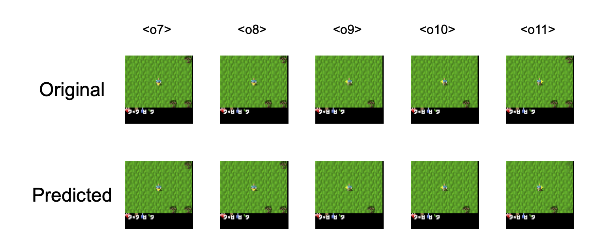
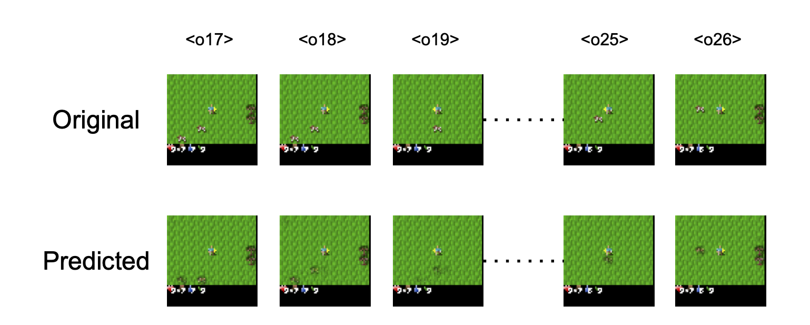

# Transformer and Recurrent Architectures for World Modeling in Long-Horizon Reinforcement Learning

This repository contains the code accompanying the master’s thesis:

**“Transformer and Recurrent Architectures for Dynamics Prediction and Policy Learning on Long-Horizon Tasks”**  
Author: **Vinal Jitendrabhai Gadhiya**  
University of Texas at Arlington

The work investigates how different sequence-modeling architectures—**Transformers**, **GRUs**, and a **Hybrid Transformer–GRU model**—perform as **world models** for long-horizon, sparse-reward reinforcement learning tasks.

---

## 📌 Motivation

Model-based reinforcement learning (MBRL) enables agents to **learn and plan using a learned model of the environment**, significantly reducing the need for expensive real interactions. However, in **open-world, long-horizon environments**, world models face major challenges:

- Long-term temporal dependencies  
- Partial observability  
- Sparse, achievement-based rewards  
- Memory of objects and events beyond the visible frame  

While Transformers excel at global context modeling and GRUs provide strong sequential memory, it is unclear which architecture—or combination—best supports **accurate dynamics prediction** and **effective downstream policy learning**.

This thesis systematically compares these architectures to answer:

> **Which world-model architecture produces the most useful latent representation for long-horizon policy learning?**

---

## 🧠 Core Idea

We decouple learning into two stages:

1. **World Model Learning**
   - Learn latent dynamics and reward prediction from real environment data.
   - Enable imagined rollouts without interacting with the environment.

2. **Policy Learning**
   - Train an actor–critic policy **entirely on imagined trajectories** generated by the learned world model.
   - Evaluate which world model yields better policy performance.

This design allows a clean comparison of how different architectures affect policy learning quality.

---

## 🏗️ Architectures Compared

### 1️⃣ Transformer-Based World Model
- Decoder-only Transformer with causal masking
- Processes sequences of encoded observation–action pairs
- Strengths:
  - Captures short-term dependencies
  - Strong contextual reasoning
- Limitations:
  - Weak persistent memory of objects outside the frame
  - Struggles with consistent world-state tracking

  
   

---

### 2️⃣ GRU-Based World Model
- Single-layer GRU with large hidden state
- Sequential processing of state–action pairs
- Strengths:
  - Stable and efficient
  - Strong short-term dynamics modeling
- Limitations:
  - Objects are forgotten once they leave the visible frame
  - Limited long-horizon spatial memory

  
   

---

### 3️⃣ Hybrid Transformer–GRU World Model (Proposed)
- Transformer for global temporal context
- GRU for persistent sequential memory
- Strengths:
  - Retains memory of recently seen objects
  - Better latent consistency over time
  - Produces more useful representations for policy learning
- Limitation:
  - Long-term memory still degrades for objects unseen for many steps

  
   

---

## 🎮 Environment: Crafter

Experiments are conducted in **Crafter**, a 2D open-world survival environment featuring:

- Sparse, achievement-based rewards
- Long-horizon crafting and survival chains
- Partial observability
- Strong dependence on memory and planning

Crafter is an ideal testbed for evaluating world models under realistic long-horizon constraints.

---

## 🔬 Training Details (High-Level)

### World Model
- RGB observations (64×64) → autoencoder → latent state
- Actions encoded as one-hot vectors
- Teacher forcing during training
- Losses:
  - Latent dynamics prediction (MSE / cosine)
  - Image reconstruction loss
  - Reward prediction loss

### Policy
- PPO with Actor–Critic + GAE
- Trained entirely on imagined rollouts
- Separate policy trained per world model
- Evaluation based on rewards and achievements

---

## 📊 Key Results

### Average Episode Reward

| Model        | Avg Reward | Std Dev |
|--------------|------------|---------|
| Transformer  | 1.45       | 1.27    |
| GRU          | 1.56       | 1.30    |
| **Hybrid**   | **2.20**   | **1.12** |

---

### Core Achievement Success Rates

| Achievement        | Transformer | GRU | **Hybrid** |
|--------------------|-------------|-----|------------|
| collect_wood       | 26%         | 48% | **50%**    |
| collect_sapling    | 53%         | 37% | **97%**    |
| place_plant        | 45%         | 32% | **90%**    |
| collect_drink      | 9%          | 40% | **31%**    |

---

### Combat & Early Crafting

| Task              | Transformer | GRU | **Hybrid** |
|-------------------|-------------|-----|------------|
| defeat_zombie     | 0%          | 0%  | **6%**     |
| eat_cow           | 0%          | 1%  | **6%**     |
| make_wood_sword   | 3%          | 1%  | **5%**     |

---

## 🧩 Key Insights

- **Transformers** capture context but lack persistent memory.
- **GRUs** are stable but forget objects once they leave the frame.
- **Hybrid Transformer–GRU models** combine:
  - Global temporal reasoning
  - Sequential memory refinement

➡️ The hybrid architecture consistently produces **better imagined rollouts**, leading to **higher policy performance** on long-horizon tasks.

---

## ⚠️ Observed Challenge

Crafter rewards achievements **only once** per episode.

During iterative training:
- World models observe mostly zero rewards after first completion
- Reward prediction collapses
- Policies may **unlearn previously mastered tasks**

This highlights an important limitation of naive iterative MBRL in sparse, first-time-only reward settings.

---

## 🚀 Future Directions

- Richer latent representations for persistent world-state tracking
- Multimodal world models (vision + language)
- Improved reward modeling for sparse, first-time achievements
- Better exploration strategies in imagined rollouts
- Hierarchical or memory-augmented world models
- Extension toward sim-to-real robotic settings

---